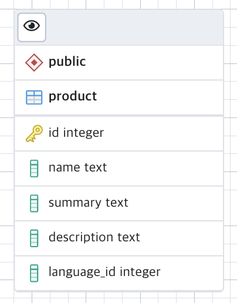
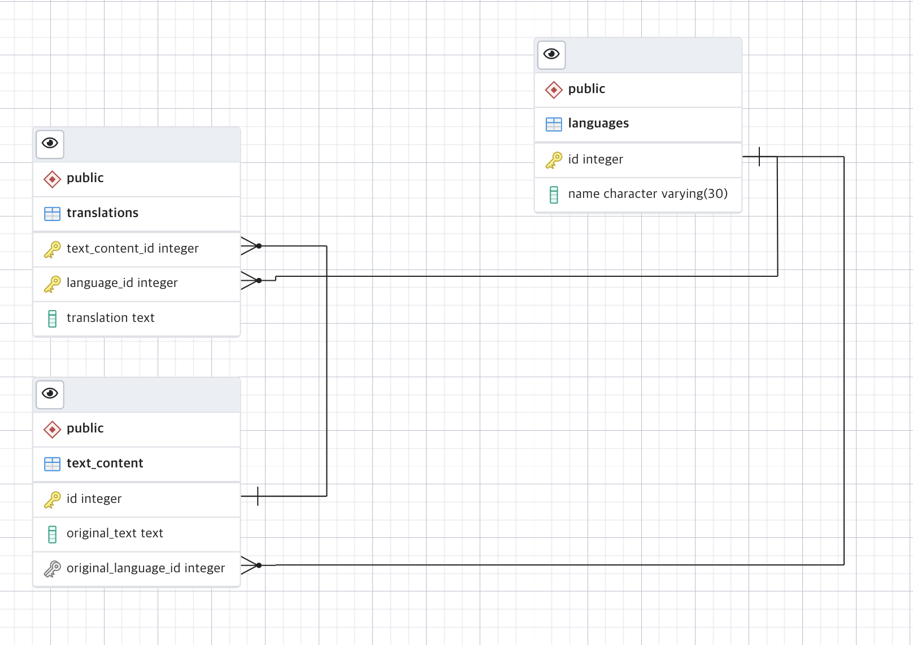
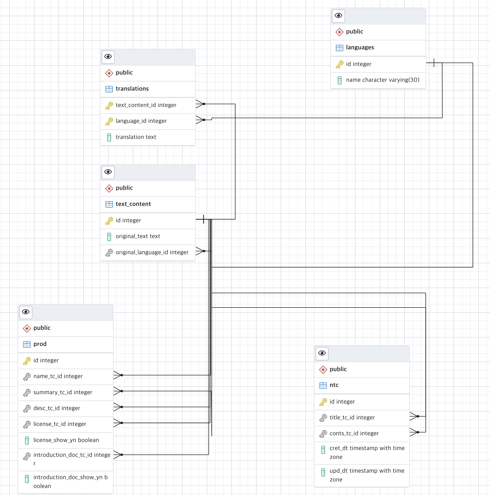
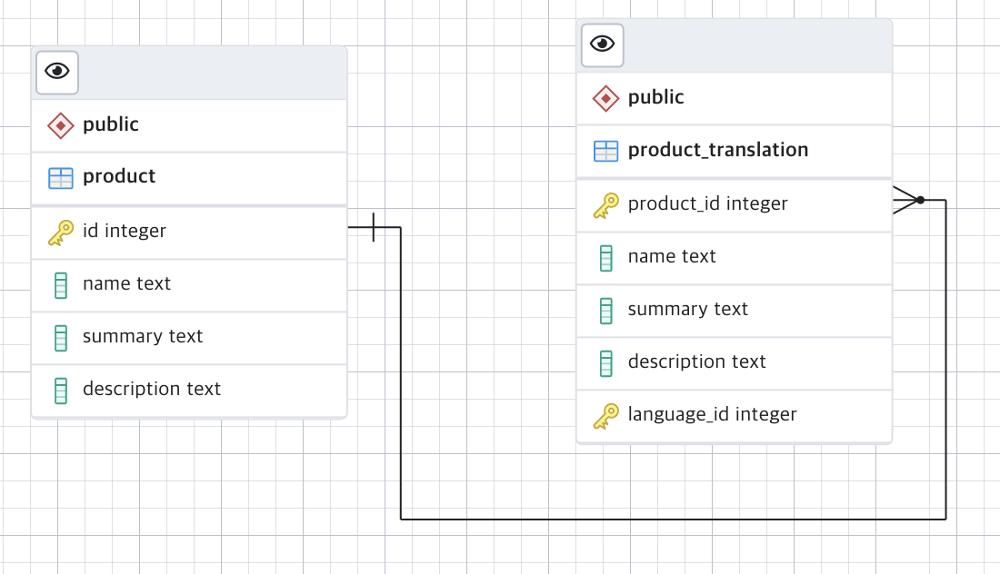

# Multi Language Database Design

In this repository, I write how I've been through designing Multi Language Database.

I tried 3 ways, each of them has its own pros and cons.

Here are the references.

https://vertabelo.com/blog/multi-language-database-design/

https://medium.com/kocsistem/what-is-the-best-database-design-for-multi-language-data-b21982dd7265

---
## Multi language data per row



pros
- easy to query
- easy design

cons
- fail to normalize (duplicated data)
- hard to manage duplicated data

So I found the ways to normalize the data.

---
## Translation Sub Schema


Every column that needs translation will pass this schema.

The main table that requires translation will have column with  `text_content_id` to join with `text_content`.

Tables
- `text_content` : contains id that is the connection between main table. It can contain original language data, for non-multi-language query.
- `translation` : contains translation for each of `text_content` in different language.
- `languages` : contains language id and name(code)

It seems perfect, because data for translation all came to translation sub schema, but there are still issues.

This is a final design with translation sub schema,



To query the data with translation data(if there is no translation data -> original data), the query(postgresql) will be like,

```sql
WITH lang AS (VALUES(2))
SELECT p.id
,COALESCE(tsName.translation,tcName.original_text) name
,COALESCE(tsSummary.translation ,tcSummary.original_text) summary
,COALESCE(tsDesc.translation,tcDesc.original_text) desc
,COALESCE(tsLicense.translation,tcLicense.original_text) license
,p.license_show_yn
,COALESCE(tsIntroductionDoc.translation,tcIntroductionDoc.original_text) intro
,p.introduction_doc_show_yn
FROM prod p
JOIN text_content tcName ON tcName.id = p.name_tc_id
LEFT OUTER JOIN translations tsName ON tsName.text_content_id=tcName.id AND tsName.language_id = (table lang)
JOIN text_content tcSummary ON tcSummary.id = p.summary_tc_id 
LEFT OUTER JOIN translations tsSummary ON tsSummary.text_content_id=tcSummary.id AND tsSummary.language_id = (table lang)
JOIN text_content tcDesc ON tcDesc.id = p.desc_tc_id 
LEFT OUTER JOIN translations tsDesc ON tsDesc.text_content_id=tcDesc.id AND tsDesc.language_id = (table lang)
JOIN text_content tcLicense ON tcLicense.id = p.license_tc_id 
LEFT OUTER JOIN translations tsLicense ON tsLicense.text_content_id=tcLicense.id AND tsLicense.language_id = (table lang)
JOIN text_content tcIntroductionDoc ON tcIntroductionDoc.id = p.introduction_doc_tc_id 
LEFT OUTER JOIN translations tsIntroductionDoc ON tsIntroductionDoc.text_content_id=tcIntroductionDoc.id AND tsIntroductionDoc.language_id = (table lang)
;
```

pros
- good normalization
- translation all occurs in translation sub schema(do not need extra table for translation)

cons
- if there are lots of  columns in the main table, the query will be very complex
- complex query -> hard to implement in application level -> hard to maintain source

---
## Additional Translation Table



add translation table for each main table

search query will be like,

```sql
SELECT p.id
,COALESCE(pt.name,p.name)
,COALESCE(pt.summary,p.summary)
,COALESCE(pt.description,p.description)
,COALESCE(pt.license,p.license)
,COALESCE(pt.introduction_doc,p.introduction_doc)
FROM prod p
LEFT OUTER JOIN prod_translations pt ON pt.product_id = p.id AND pt.language_id=3
;
```

pros
- easy join query
- normalization

cons
- needs translation table for each main table

---
## Conclusion

When there are lots of tables with few columns -> Translation Sub Schema will be accurate

When there are few tables -> Additional Translation Table will be easy solution